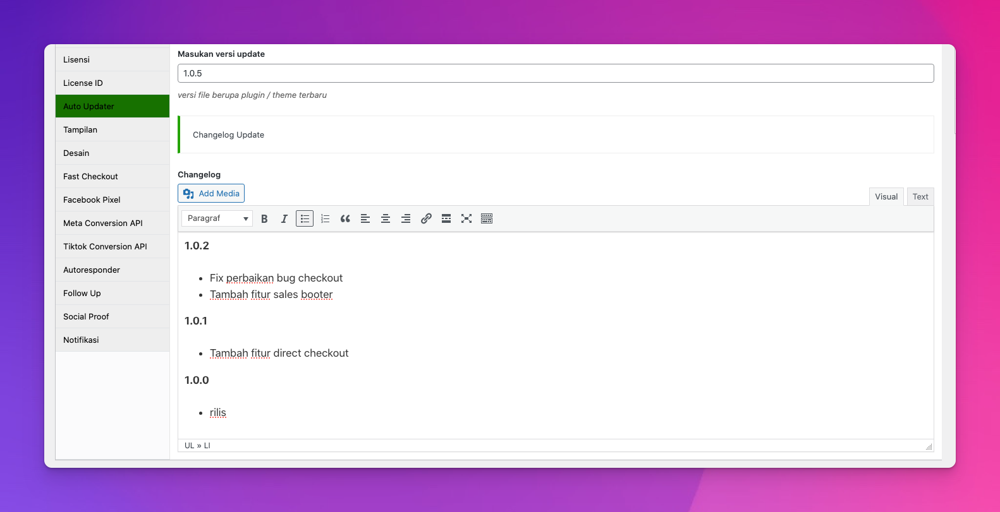

# Activating, Checking dan Deactivating License di Plugin WordPress

:::danger Catatan Penting
Dokumentasi ini tidak diperlukan jika menggunakan API Updater. Hanya merujuk ke dokumen ini jika Anda tidak menggunakan pembaru atau jika ini untuk referensi:
[Lihat dokumentasi kami tentang cara mengintegrasikan auto update untuk plugin WordPress Anda.](https://developer.wordpress.org/apis/transients/)
[Lihat dokumentasi kami tentang cara mengintegrasikan auto update untuk theme WordPress Anda.](https://developer.wordpress.org/apis/transients/)
:::

## Activating
Dengan Lisensi, agar kode lisensi dapat dimanfaatkan sepenuhnya, kode tersebut harus diaktifkan. Hal ini dapat dilakukan melalui:

Pembeli dapat mengaktifkan lisensi dari jarak jauh melalui sistem di plugin/tema/app Anda yang menggunakan API untuk memicu aktivasi.

**Catatan:** contoh plugin dan implementasi yang ditunjukkan dalam dokumen ini adalah murni contoh. Implementasi Lisensi mengambil sampel ini dan mengintegrasikannya dengan mulus ke halaman pengaturan plugin Anda.

Dalam dokumentasi ini, kami akan menunjukkan cara mengaktifkan lisensi dari jarak jauh melalui sistem yang ditambahkan ke plugin WordPress Anda. Kode contoh yang kami tunjukkan kepada Anda dalam contoh ini adalah kode persis sama yang disertakan dengan contoh plugin dan tema, tersedia untuk diunduh setelah membeli addon sejoli license.

Ada dua komponen utama untuk mengaktifkan lisensi via API:
- **Menyimpan kode lisensi** dalam data (opsi theme atau plugin)
- **Mengirim kode lisensi** yang disimpan melalui API ke web untuk verifikasi dan aktivasi

Saat lisensi diaktifkan melalui API, status lisensi di dashboard web Anda akan diperbarui dari 'inactive' (keadaan default) menjadi 'active'.

Pertama mari kita lihat cara membuat halaman opsi sederhana untuk menyimpan lisensi kita.

```bash
<?php
function sejoli_sample_license_menu() {
	add_plugins_page( 'Plugin License', 'Plugin License', 'manage_options', SEJOLI_SAMPLE_PLUGIN_LICENSE_PAGE, 'sejoli_sample_license_page' );
}
add_action('admin_menu', 'sejoli_sample_license_menu');

function sejoli_sample_license_page() {
	$license = get_option( 'sejoli_sample_license_key' );
	$status  = get_option( 'sejoli_sample_license_status' );
	?>
	<div class="wrap">
		<h2><?php _e('Plugin License Options'); ?></h2>
		<form method="post" action="options.php">

			<?php settings_fields('sejoli_sample_license'); ?>

			<table class="form-table">
				<tbody>
					<tr valign="top">
						<th scope="row" valign="top">
							<?php _e('License Key'); ?>
						</th>
						<td>
							<input id="sejoli_sample_license_key" name="sejoli_sample_license_key" type="text" class="regular-text" value="<?php esc_attr_e( $license ); ?>" />
							<label class="description" for="sejoli_sample_license_key"><?php _e('Enter your license key'); ?></label>
						</td>
					</tr>
					<?php if( false !== $license ) { ?>
						<tr valign="top">
							<th scope="row" valign="top">
								<?php _e('Activate License'); ?>
							</th>
							<td>
								<?php if( $status !== false && $status == 'valid' ) { ?>
									<span style="color:green;"><?php _e('active'); ?></span>
									<?php wp_nonce_field( 'sejoli_sample_nonce', 'sejoli_sample_nonce' ); ?>
									<input type="submit" class="button-secondary" name="sejoli_license_deactivate" value="<?php _e('Deactivate License'); ?>"/>
								<?php } else {
									wp_nonce_field( 'sejoli_sample_nonce', 'sejoli_sample_nonce' ); ?>
									<input type="submit" class="button-secondary" name="sejoli_license_activate" value="<?php _e('Activate License'); ?>"/>
								<?php } ?>
							</td>
						</tr>
					<?php } ?>
				</tbody>
			</table>
			<?php submit_button(); ?>

		</form>
	<?php
}

function sejoli_sample_register_option() {
	// creates our settings in the options table
	register_setting('sejoli_sample_license', 'sejoli_sample_license_key', 'sejoli_sanitize_license' );
}
add_action('admin_init', 'sejoli_sample_register_option');

function sejoli_sanitize_license( $new ) {
	$old = get_option( 'sejoli_sample_license_key' );
	if( $old && $old != $new ) {
		delete_option( 'sejoli_sample_license_status' ); // new license has been entered, so must reactivate
	}
	return $new;
}
```

Kode ini menyiapkan item submenu di menu Plugin yang disebut **Lisensi Plugin**. Kami menggunakan halaman plugin dalam contoh ini, tetapi kodenya sama untuk theme.

Ada dua baris di bagian atas kode:

```bash
$license = get_option( 'sejoli_sample_license_key' );
$status = get_option( 'sejoli_sample_license_status' );
```

Yang pertama adalah lisensi itu sendiri dan yang kedua adalah status lisensinya. Setelah kami mengaktifkan lisensi kami, kami akan mengubah status (di situs lokal kami) menjadi `active`. Hal ini agar kita dapat menampilkan tombol **Activate License** jika lisensinya belum diaktifkan, dan menyembunyikan tombol tersebut jika sudah diaktifkan. Lihat tangkapan layar di bawah ini:





Idenya di sini adalah pertama-tama kita memasukkan kode lisensi dan klik “Save Changes”, yang menyebabkan kode lisensi disimpan dalam opsi plugin/theme kami. Setelah opsi disimpan, kami mengklik tombol “Activate License” untuk memicu panggilan API.

Tombol aktifkan hanyalah sebuah kolom input sederhana dengan tipe **submit** dan atribut nama yang berbeda dari tombol simpan kita. Namanya harus berbeda-beda agar kita bisa mengetahui kapan tombol aktifkan lisensi diklik.

Untuk mengaktifkan lisensinya, kita hanya perlu “mengawasi” kapan tombol aktivasi diklik. Cara kita melakukannya adalah dengan menyiapkan fungsi yang terhubung ke hook “admin_init”, seperti:

```bash
<?php
function sejoli_sample_activate_license() {

	// listen for our activate button to be clicked
	if( isset( $_POST['sejoli_license_activate'] ) ) {

		// run a quick security check
	 	if( ! check_admin_referer( 'sejoli_sample_nonce', 'sejoli_sample_nonce' ) )
			return; // get out if we didn't click the Activate button

		// retrieve the license from the database
		$license = trim( get_option( 'sejoli_sample_license_key' ) );


		// data to send in our API request
		$api_params = array(
			'sejoli_action' => 'activate_license',
			'license'    => $license,
			'item_name'  => urlencode( EDD_SAMPLE_ITEM_NAME ), // the name of our product in EDD
			'url'        => home_url()
		);

		// Call the custom API.
		$response = wp_remote_post( EDD_SAMPLE_STORE_URL, array( 'timeout' => 15, 'sslverify' => false, 'body' => $api_params ) );

		// make sure the response came back okay
		if ( is_wp_error( $response ) || 200 !== wp_remote_retrieve_response_code( $response ) ) {

			$message =  ( is_wp_error( $response ) && ! empty( $response->get_error_message() ) ) ? $response->get_error_message() : __( 'An error occurred, please try again.' );

		} else {

			$license_data = json_decode( wp_remote_retrieve_body( $response ) );

			if ( false === $license_data->success ) {

				switch( $license_data->error ) {

					case 'expired' :

						$message = sprintf(
							__( 'Your license key expired on %s.' ),
							date_i18n( get_option( 'date_format' ), strtotime( $license_data->expires, current_time( 'timestamp' ) ) )
						);
						break;

					case 'revoked' :

						$message = __( 'Your license key has been disabled.' );
						break;

					case 'missing' :

						$message = __( 'Invalid license.' );
						break;

					case 'invalid' :
					case 'site_inactive' :

						$message = __( 'Your license is not active for this URL.' );
						break;

					case 'item_name_mismatch' :

						$message = sprintf( __( 'This appears to be an invalid license key for %s.' ), EDD_SAMPLE_ITEM_NAME );
						break;

					case 'no_activations_left':

						$message = __( 'Your license key has reached its activation limit.' );
						break;

					default :

						$message = __( 'An error occurred, please try again.' );
						break;
				}

			}

		}

		// Check if anything passed on a message constituting a failure
		if ( ! empty( $message ) ) {
			$base_url = admin_url( 'plugins.php?page=' . EDD_SAMPLE_PLUGIN_LICENSE_PAGE );
			$redirect = add_query_arg( array( 'sl_activation' => 'false', 'message' => urlencode( $message ) ), $base_url );

			wp_redirect( $redirect );
			exit();
		}

		// $license_data->license will be either "valid" or "invalid"

		update_option( 'sejoli_sample_license_status', $license_data->license );
		wp_redirect( admin_url( 'plugins.php?page=' . EDD_SAMPLE_PLUGIN_LICENSE_PAGE ) );
		exit();
	}
}
add_action('admin_init', 'sejoli_sample_activate_license');
```

Jika semuanya berjalan baik setelah mengklik tombol **Activate License**, tombol **Activate License** akan diganti dengan kata **Deactivate License**, itu menandakan bahwa status lisensi aktif, data aktivasi lisensi pada web ini muncul di menu lisensi web Sejoli Anda. Jika terjadi kesalahan saat mengaktifkan kode lisensi, halaman akan dimuat ulang dan parameter kesalahan dan pesan akan ditambahkan ke URL. Kami kemudian dapat menggunakan hook admin_notices (atau metode lain yang berlaku) untuk menampilkan kesalahan kepada pelanggan:

```bash
<?php
/**
 * This is a means of catching errors from the activation method above and displaying it to the customer
 */
function sejoli_sample_admin_notices() {
	if ( isset( $_GET['sl_activation'] ) && ! empty( $_GET['message'] ) ) {

		switch( $_GET['sl_activation'] ) {

			case 'false':
				$message = urldecode( $_GET['message'] );
				?>
				<div class="error">
					<p><?php echo $message; ?></p>
				</div>
				<?php
				break;

			case 'true':
			default:
				// Developers can put a custom success message here for when activation is successful if they way.
				break;

		}
	}
}
add_action( 'admin_notices', 'sejoli_sample_admin_notices' );
```


## Pengaturan

Dalam addon Sejoli Lisensi Anda terdapat direktori bernama `/samples/sejoli-sample-theme/updater/`. Folder ini perlu disalin ke folder utama theme Anda.

Kemudian tempatkan kode berikut ke dalam `function.php` theme Anda:

```bash
/**
 * Load theme updater functions.
 * Action is used so that child themes can easily disable.
 */

function prefix_theme_updater() {
    require( get_template_directory() . '/updater/theme-updater.php' );
}
add_action( 'after_setup_theme', 'prefix_theme_updater' );
```

Silakan ubah awalan (prefix) menjadi sesuatu yang sesuai dengan theme Anda. Kode ini termasuk kode updater.

## Konfigurasikan Pembaruan

Edit `/updater/theme-updater.php` dan masukkan nilai yang sesuai untuk elemen array berikut:

```bash
$config = array(
    'remote_api_url' => 'https://YOURWEB.com', // Web tempat Sejoli diinstal
    'item_name' => 'Nama Tema', // Nama theme
    'theme_slug' => 'theme-slug', // Theme slug
    'version' => '1.0.0', // Versi terkini dari theme ini
    'author' => 'Sejoli', // Pemilik theme ini
    'download_id' => '', // Opsional, digunakan untuk membuat link perpanjangan lisensi
    'renew_url' => '', // Opsional, memungkinkan tautan perpanjangan lisensi khusus,
    'item_id' => '', // ID produk pada web 
),
```

Selain itu, dalam file yang sama, ubah domain teks `sejoli-theme-updater` agar sesuai dengan theme Anda. Contoh:

```bash
// Strings
    $strings = array(
        'theme-license'             => __( 'Theme License', 'sejoli-theme-updater' ),
	)
```

Misalnya, jika pelanggan memasukkan kode lisensi yang tidak valid, pesan kesalahan akan ditampilkan:


## Checking

Anda dapat dengan mudah memeriksa apakah kode lisensi valid kapan saja. Anda mungkin ingin melakukan ini untuk membatasi fungsi tertentu dalam theme atau plugin hanya untuk pengguna dengan kode lisensi yang valid.

Memeriksa validitas kode lisensi cukup sederhana; yang diperlukan hanyalah kami melakukan permintaan jarak jauh ke web toko kami dengan beberapa parameter tertentu. Lihat fungsinya di bawah ini:

```bash
function edd_sample_theme_check_license() {
	$store_url = 'http://yoursite.com';
	$item_name = 'Your Item Name';
	$license = '834bbb2d27c02eb1ac11f4ce6ffa20bb';
	$api_params = array(
		'edd_action' => 'check_license',
		'license' => $license,
		'item_name' => urlencode( $item_name ),
		'url' => home_url(),
                'environment' => function_exists( 'wp_get_environment_type' ) ? wp_get_environment_type() : 'production',

	);
	$response = wp_remote_post( $store_url, array( 'body' => $api_params, 'timeout' => 15, 'sslverify' => true ) );
  	if ( is_wp_error( $response ) ) {
		return false;
  	}

	$license_data = json_decode( wp_remote_retrieve_body( $response ) );

	if( $license_data->license == 'valid' ) {
		echo 'valid';
		exit;
		// this license is still valid
	} else {
		echo 'invalid';
		exit;
		// this license is no longer valid
	}
}
```

**Catatan:** jika Anda terus-menerus memeriksa validitas kode lisensi, mungkin untuk memblokir penggunaan plugin atau theme ketika lisensinya habis masa berlakunya, Anda HARUS menyimpan hasil pemeriksaan dalam cache agar permintaan tidak dilakukan pada setiap pemuatan halaman. **[Transients API](https://developer.wordpress.org/apis/transients/)** adalah cara terbaik untuk menyimpan respons API dalam cache.

## Deactivating

Setelah lisensi diaktifkan, lisensi juga dapat dinonaktifkan dari jarak jauh. Biasanya alasan menonaktifkan lisensi adalah untuk mengizinkan aktivasi lisensi di web tambahan setelah batas aktivasi tercapai.

Proses penonaktifan hampir identik dengan proses aktivasi. Kami melakukan permintaan jarak jauh dan mengirimkan detail kode lisensi yang kami nonaktifkan. Permintaan jarak jauh dilakukan seperti ini:

```bash
// data to send in our API request
$api_params = array(
	'edd_action' => 'deactivate_license',
	'license'    => '2ec66bae356be570236531ccba06a45b',
	'item_name'  => 'Sample Plugin', // the name of our product in EDD
	'url'        => home_url(),
        'environment' => function_exists( 'wp_get_environment_type' ) ? wp_get_environment_type() : 'production',
);
// Send the remote request
$response = wp_remote_post( 'http://yoursite.com', array( 'body' => $api_params, 'timeout' => 15, 'sslverify' => true ) );
```

$response var akan menjadi objek json yang memberi tahu kita apakah permintaan penonaktifan berhasil atau tidak. Jika berhasil maka responnya adalah:

**Catatan**: Tanggal/waktu adalah stempel waktu, tidak seperti respons json lainnya yang merupakan waktu tanggal.

```bash
{
  "success": true,
  "license": "deactivated",
  "item_id": false,
  "item_name": "element-widgets",
  "checksum": "a42bb746b5321dabec54e1cd6d51a676",
  "expires": "2024-10-16 21:41:09",
  "payment_id": 32,
  "customer_name": "Slamet Baraka",
  "customer_email": "dev-slamet@wgmail.com"
}
```

Jika lisensi gagal dinonaktifkan, responsnya adalah:

```bash
{
  "success": false,
  "license": "failed",
  "item_id": false,
  "item_name": "element-widgets",
  "checksum": "a42bb746b5321dabec54e1cd6d51a676",
  "expires": "2024-10-16 21:41:09",
  "payment_id": 32,
  "customer_name": "Slamet Baraka",
  "customer_email": "dev-slamet@wgmail.com"
}
```

Setelah lisensi berhasil dinonaktifkan, kolom Jumlah web di menu Lisensi di member area akan dikurangi.