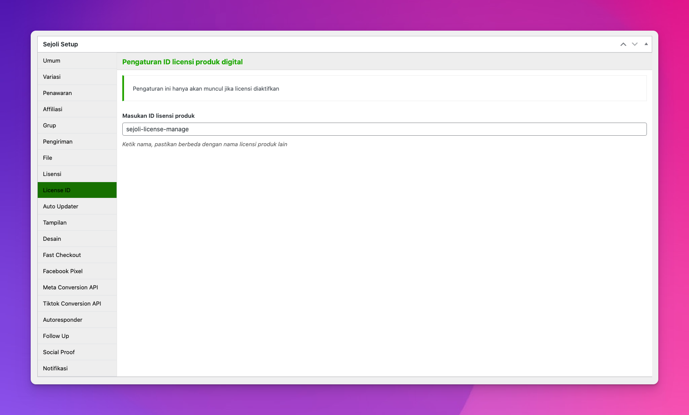
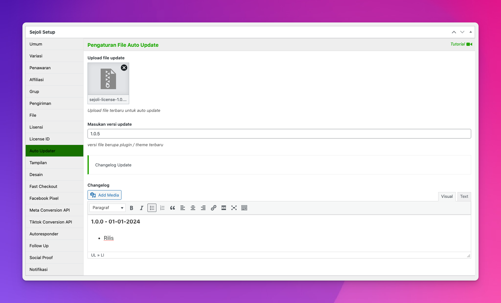

# Cara Penggunaan

Tutorial ini akan memandu Anda melalui petunjuk pengaturan untuk add-on Sejoli License.

**Download Sample Plugin dan Theme WordPress**
- [Download Sample Plugin](./files/sejoli-sample-plugin.zip)
- [Download Sample Theme](./files/sejoli-sample-theme.zip)

:::tip Add-on Sejoli License
Meskipun add-on ini dibuat khusus produk digital berupa plugin dan theme WordPress, karena API yang disertakan, sebagian besar aplikasi basis web atau sejenisnya dapat memanfaatkan fitur yang telah disediakan.
:::

Setelah diinstal & diaktifkan add-on sejoli license, pengaturan ada di:
- Pengaturan Aktivasi Lisensi pembelian anda, ambil kode lisensi di member area
- Pengaturan Produk Sejoli: Menu Products → All  Products → Add New

## Mengonfigurasi Opsi Produk

Pembuatan kode lisensi diatur berdasarkan produk per produk, sehingga tidak semua produk yang dijual melalui web Anda diharuskan memiliki pembuatan kode lisensi. Untuk mengatur produk agar menghasilkan kode lisensi saat dibeli, buka halaman produk Anda, lalu klik Edit pada produk yang ingin Anda konfigurasi.

Di bawah ini adalah tangkapan layar bagian antarmuka pengguna dalam satu produk untuk menyiapkan lisensi untuk produk tersebut.

**1. Pengaturan Lisensi**

Pada layar edit produk tipe produk digital bagian tab Lisensi muncul ada kotak **Jumlah Penggunaan Lisensi** baru yang ditambahkan. Semua pengaturan untuk lisensi khusus untuk produk digital saat ini dilakukan di kotak ini.

:::tip Jumlah Penggunaan Lisensi
Ini adalah berapa kali maksimum setiap kode lisensi dapat diaktifkan. Jika Anda ingin membatasi kode lisensi hingga 10 penggunaan per pelanggan, masukkan 10. Jika Anda tidak ingin menerapkan batasan batas apa pun, biarkan kosong atau masukkan 0.
:::

**2. License ID**

Pengaturan license ID untuk membatasi kode license agar tidak bisa dipakai pada produk lain dan sebagai nama direktori/folser plugin dan theme untuk auto updater.

:::tip
Jika membuat produk yang sama tapi beda jumlah aktivasi lisensi maka ID Lisensi tetap sama
:::

**3. Auto Updater**

Pengaturan Auto Update pada tab Auto Updater, ada beberapa bagian. diantaranya:

## Masukkan versi update

Ini sesuai dengan nomor versi plugin atau theme Anda saat ini yang tersedia. Jika Anda menjual versi 1.0, masukkan 1.0 di sini. Jika versi yang tersedia saat ini adalah 1.5, masukkan 1.5 di sini. Nomor versi ini digunakan khusus untuk plugin dan theme WordPress yang telah menerapkan sistem auto update, namun juga dapat digunakan oleh jenis aplikasi lain dengan memanfaatkan API yang disertakan.

## Upload File Update

Ini memungkinkan Anda mengatur file .zip (atau mungkin format lain) yang dikirimkan ke pengguna saat melakukan auto update. Opsi ini digunakan khusus untuk plugin dan theme WordPress yang telah menerapkan sistem auto update, namun juga dapat digunakan oleh jenis app/perangkat lunak lain dengan memanfaatkan API yang disertakan. Jika Anda menjual plugin atau theme WordPress, opsi ini harus disetel ke format .zip yang hanya berisi file plugin atau theme yang diperlukan. File `.zip` ini diatur melalui bagian Upload File Update.

## Changelog

Ini adalah dokumentasi perubahan yang telah dilakukan pada setiap versi plugin/theme/perangkat lunak. Kapan pun versi baru dirilis, Anda harus menambahkan catatan tentang apa yang berubah di sini. Catatan ini akan ditampilkan dalam pemberitahuan pemutakhiran “Yang Baru” yang dapat dilihat pengguna saat memutakhirkan plugin atau theme WordPress mereka. Jika Anda tidak menjual plugin atau tema WordPress, log perubahan ini masih dapat digunakan melalui API yang disertakan.