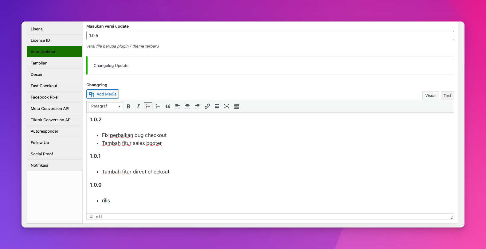

# Changelog

Sejoli License memiliki mekanisme bawaan untuk mengaitkan log perubahan (Changelog) dengan Unduhan. Hal ini memudahkan untuk selalu memperbarui log perubahan serta mudah dilihat di web untuk Unduhan apa pun.

## Membuat log perubahan 

Saat mengedit membuat produk digital dengan mengaktifkan Lisense.

Salah satu fitur yang akan muncul ketika lisensi diaktifkan adalah kotak teks WYSIWYG. Buat log perubahan Anda di kotak ini.



## Melihat Changelog

Untuk melihat log perubahan pada produk download yang memilikinya, kunjungi terlebih dahulu halaman produk tersebut.
Kemudian tambahkan ini ke akhir URL:

```bash
?changelog=1
```

Contoh: url produk di sejoli 
```bash
http://YOURWEB.com/product/element-widgets/?changelog=1
```

Dan kemudian halaman tersebut akan menampilkan log perubahan.