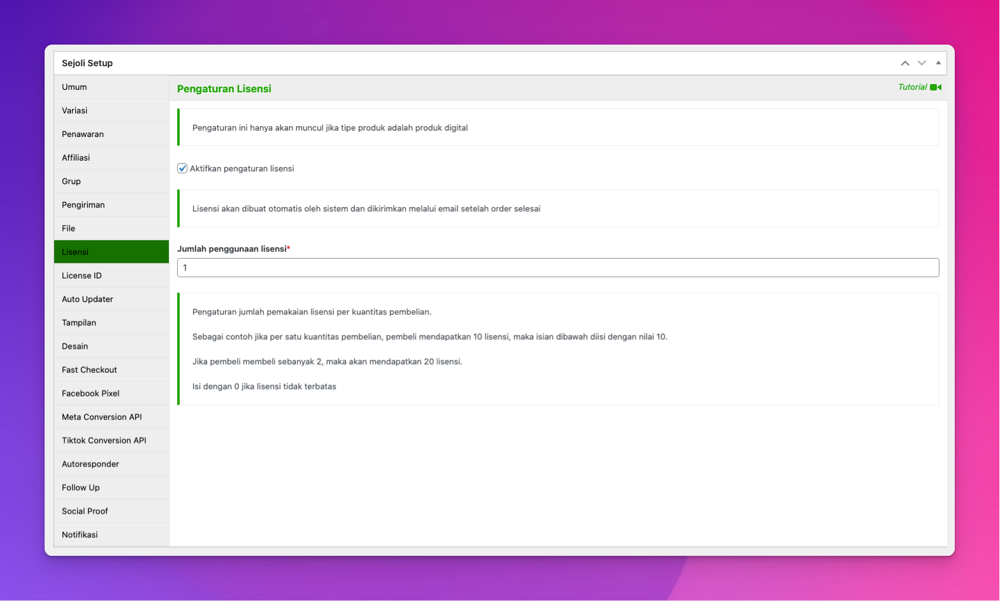

# Implementasi Updater untuk Theme WordPress

Dengan addon Sejoli Lisensi, Anda dapat mengatur pembaruan otomatis (auto update) untuk theme. Ini tidak berarti bahwa theme pelanggan Anda akan diperbarui dengan sendirinya, melainkan pelanggan Anda dapat memperbarui theme mereka menggunakan alat pembaruan WordPress tradisional, seolah-olah theme tersebut di hosting di WordPress.org.

## Pengaturan

Dalam addon Sejoli Lisensi Anda terdapat direktori bernama /samples/sejoli-sample-theme/updater/. Folder ini perlu disalin ke folder utama theme Anda.

Kemudian tempatkan kode berikut ke dalam `function.php` theme Anda:

```bash
/**
 * Load theme updater functions.
 * Action is used so that child themes can easily disable.
 */

function prefix_theme_updater() {
    require( get_template_directory() . '/updater/theme-updater.php' );
}
add_action( 'after_setup_theme', 'prefix_theme_updater' );
```

Silakan ubah awalan (prefix) menjadi sesuatu yang sesuai dengan theme Anda. Kode ini termasuk kode updater.

## Konfigurasikan Pembaruan

Edit `/updater/theme-updater.php` dan masukkan nilai yang sesuai untuk elemen array berikut:

```bash
$config = array(
    'remote_api_url' => 'https://YOURWEB.com', // Web tempat Sejoli diinstal
    'item_name' => 'Nama Tema', // Nama theme
    'theme_slug' => 'theme-slug', // Theme slug
    'version' => '1.0.0', // Versi terkini dari theme ini
    'author' => 'Sejoli', // Pemilik theme ini
    'download_id' => '', // Opsional, digunakan untuk membuat link perpanjangan lisensi
    'renew_url' => '', // Opsional, memungkinkan tautan perpanjangan lisensi khusus,
    'item_id' => '', // ID produk pada web 
),
```

Selain itu, dalam file yang sama, ubah domain teks `sejoli-theme-updater` agar sesuai dengan theme Anda. Contoh:

```bash
// Strings
    $strings = array(
        'theme-license'             => __( 'Theme License', 'sejoli-theme-updater' ),
	)
```

## Pengemasan dan Penjualan

Theme Anda harus di-zip sama seperti theme lainnya, tidak ada perbedaan. Kemudian buat produk baru di Sejoli.

Selesaikan semuanya seperti yang Anda lakukan pada produk biasa, unggah file theme Anda dan berikan harga, dll.

Kemudian pastikan untuk mencentang kotak untuk mengaktifkan lisensi. **Ini adalah kode untuk proses pembaruan**.



Sebagian besar pengaturan dalam kotak meta Lisensi dapat diatur sesuai keinginan Anda, namun nomor versi penting. Saat Anda menambah nomor versi, ini akan mengingatkan web pelanggan Anda bahwa ada versi baru. Untuk versi awal Anda, pilih sesuatu dan perbesar hanya ketika tiba waktunya untuk versi baru. Contoh: mulai dari 1.0 dan kemudian lanjutkan ke 1.1 hanya jika Anda ingin semua orang mendapatkan versi baru.

## Memperbarui theme Anda

Bila Anda memilih untuk merilis versi baru, ganti file lama dengan yang baru. Kemudian masukkan beberapa teks ke dalam kolom Changelog di tab Auto Updater. Terakhir, tambah nomor versi dan simpan unduhan. Kemudian web pelanggan Anda akan diberitahu bahwa ada versi baru, dan mereka akan dapat mengklik Perbarui.

## Catatan penting
- Kode yang ditampilkan pada halaman ini murni untuk tujuan demonstratif dan tidak dimaksudkan untuk digunakan apa adanya. Jangan menyalin dan menempelkannya ke theme Anda dan mengharapkannya berfungsi apa adanya.
- Semua nama fungsi yang ditambahkan ke plugin Anda harus mendapatkan awalan unik. Kami telah menggunakan **sejoli_sample_** di seluruh contoh ini. Jangan simpan **sejoli_sample_** di plugin Anda sendiri, gantilah dengan awalan unik Anda sendiri.
- Nama konstanta harus diubah. Jangan simpan sebagai `SEJOLI_ITEM_NAME` dan `SEJOLI_STORE_URL`. Gunakan konstanta unik Anda sendiri.

